# PhaseCanvas

A browser-based XRD, Raman and IR figure editor for preparing publication-ready scientific graphics.

[Open the application](https://make-figure.vercel.app/) · [Report a problem](https://github.com/MDES-CEA/Make_figure/issues/new?template=bug_report.yml)

Data import, signal processing, reference management, figure editing and export are combined in a single interface. Processing is performed locally in the browser: the application does not upload imported measurements to a server.

<table>
  <tr>
    <th width="33%">XRD workspace</th>
    <th width="33%">Raman workspace</th>
    <th width="33%">IR workspace</th>
  </tr>
  <tr>
    <td>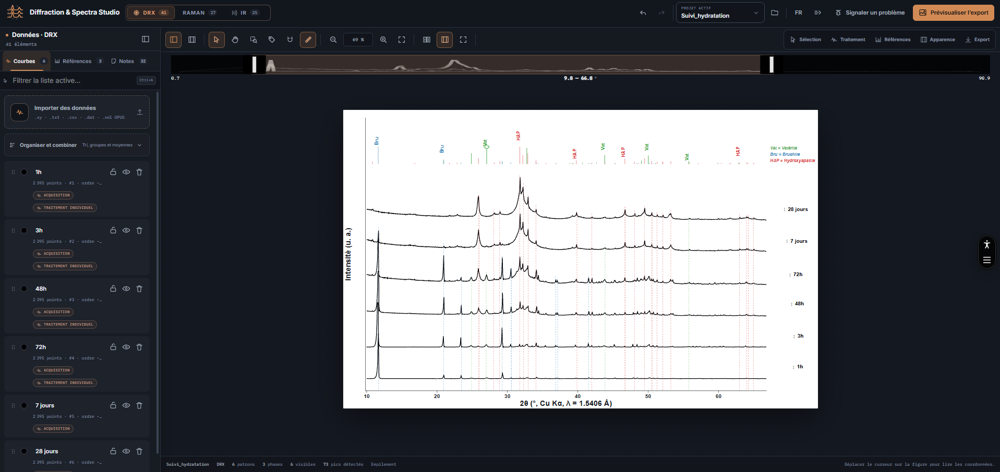</td>
    <td>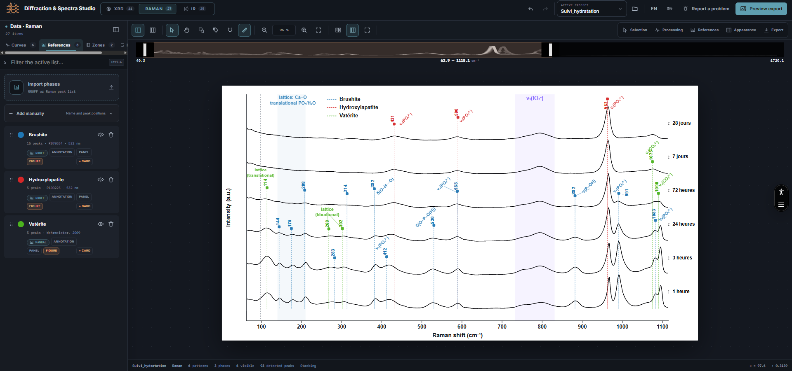</td>
    <td>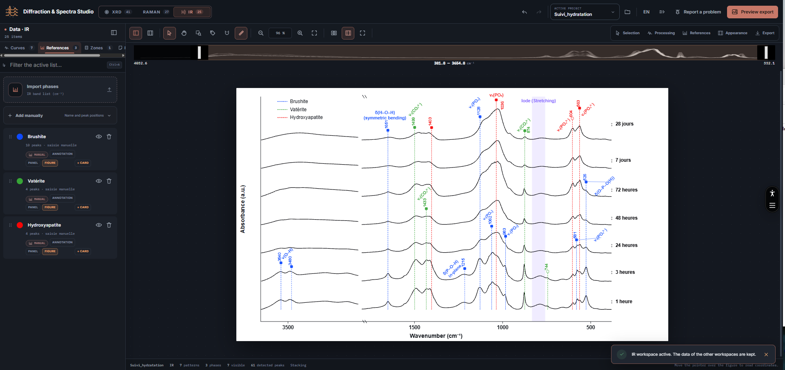</td>
  </tr>
</table>

## Main capabilities

- Keep dedicated **XRD**, **Raman** and **IR** workspaces inside the same project.
- Import several acquisitions and display them as stacked, overlaid, waterfall or multi-panel figures.
- Apply smoothing, percentile clipping, normalisation and several baseline-correction methods.
- Detect peaks, fit individual or overlapping peaks, align acquisition series and track peak positions.
- Add XRD phase references, Raman reference spectra, IR band lists and manually entered reference peaks.
- Display references as phase annotations, sticks over the curves or rows in a separate reference panel.
- Add notes and edit labels, typography, colours, line styles, axes, grids and figure layout.
- Preview the normalised output before exporting to **PNG**, **TIFF**, **SVG** or **PDF**.
- Export processed data, detected peaks and integrated spectral zones as CSV files.
- Save and restore complete projects as portable JSON sessions.
- Switch the interface between English and French.

## Quick start

1. [Open the application](https://make-figure.vercel.app/).
2. Select **Sample data** to inspect a synthetic hydration study containing XRD, Raman and IR workspaces, or import an acquisition from the left data panel. The example is generated locally and contains no experimental or third-party reference measurements.
3. Open **Processing** to prepare the signal.
4. Add references from the **References** tab in the data panel.
5. Use **Appearance** to compose the final layout.
6. Select **Preview export**, inspect the normalised result and download the required format.

No account or installation is required for the hosted application.

## Project walkthrough

### 1. Import acquisitions

Drag files into the application or select **Import data** from the **Curves** tab in the left panel. Recognised files are routed to the appropriate analysis workspace when their format identifies the measurement type.

Once at least one acquisition is loaded, the figure appears in the central canvas. Each curve remains available in the data list for selection, renaming, recolouring, reordering, visibility control and deletion.

### 2. Process the signal

Open **Processing** from the compact toolbar above the figure. Processing remains non-destructive: the imported source values are retained while the displayed result is recalculated from the current settings.

Available tools include:

- moving-average smoothing and percentile clipping;
- per-pattern and global normalisation;
- rolling-minimum, SNIP, rubber-band, polynomial and asymmetric least-squares baseline correction;
- experimental peak detection with configurable thresholds and CSV export;
- individual peak fitting and multi-peak deconvolution;
- acquisition-series alignment and peak tracking;
- XRD radiation, zero-shift and instrumental corrections.

Controls that are not required for the current task remain collapsed by default.

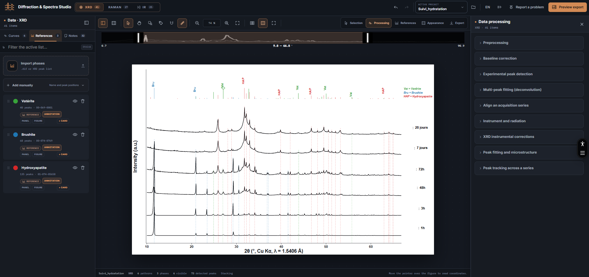

### 3. Add references and annotations

Import reference files from the **References** tab in the left panel. XRD and spectral peak lists can also be entered manually.

Each reference can be shown independently in three locations:

- **Phase annotations** above the experimental curves;
- **On figure** as sticks overlaid on the main plot;
- **Reference panel** as dedicated rows below the curves.

Visibility, line style, stick height, peak values, names and subtitles can be controlled separately. Selected annotations can also be adjusted directly on the figure.

<table>
  <tr>
    <th width="33%">Phase annotations</th>
    <th width="33%">References on the figure</th>
    <th width="33%">Reference panel</th>
  </tr>
  <tr>
    <td>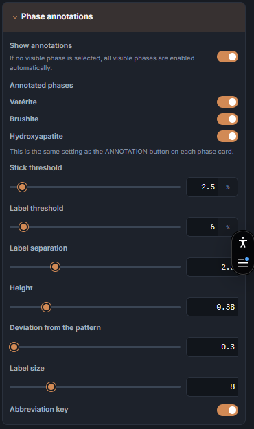</td>
    <td>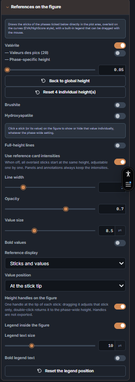</td>
    <td>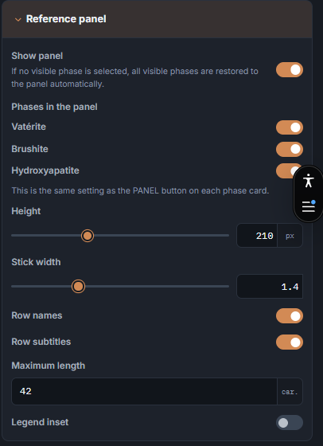</td>
  </tr>
</table>

### 4. Compose the figure

Open **Appearance** to configure the scientific layout:

- figure width and plot margins;
- X and Y ranges, tick spacing, grid and secondary axes;
- stacked, overlay, waterfall and panel layouts;
- axis breaks and movable zoom insets;
- curve colours, opacity, fill and line width;
- font family, size and bold state for each text role;
- reusable style presets.

The visible X range can also be changed from the navigator above the figure. Text elements can be selected directly on the canvas to expose compact size and bold controls.

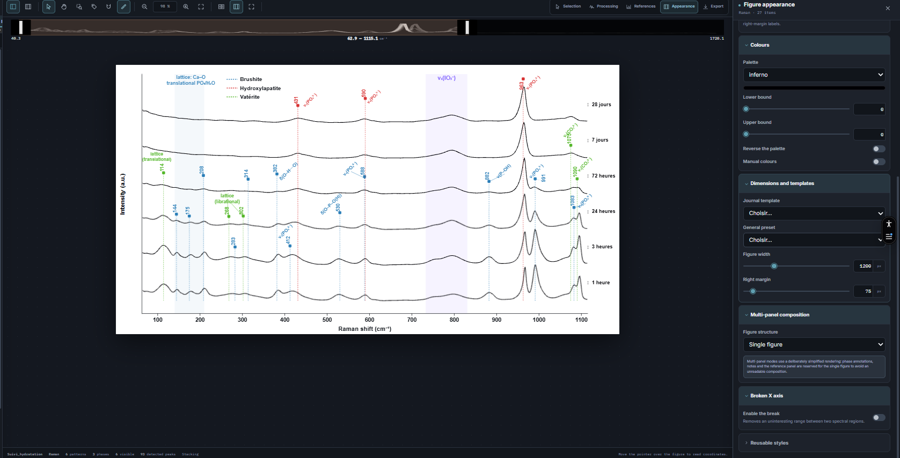

Notes are created from the **Notes** tab in the left panel. Select a note to edit its content, anchor, font, leader line and placement from **Selection** in the contextual tool panel.

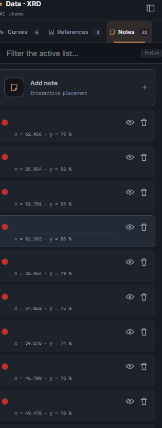

### 5. Preview and export

Open **Export** to configure raster scale, resolution and background. Select **Preview export** before downloading the figure.

The preview is generated from the same normalised SVG used by the exporter, independently of the editor zoom. It reports the output dimensions, background and curve line width so that rendering problems can be detected before the file is written.

<table>
  <tr>
    <th width="50%">Export settings</th>
    <th width="50%">Normalised export preview</th>
  </tr>
  <tr>
    <td>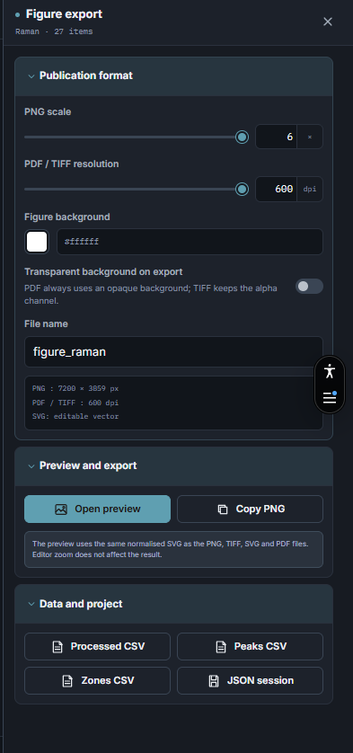</td>
    <td>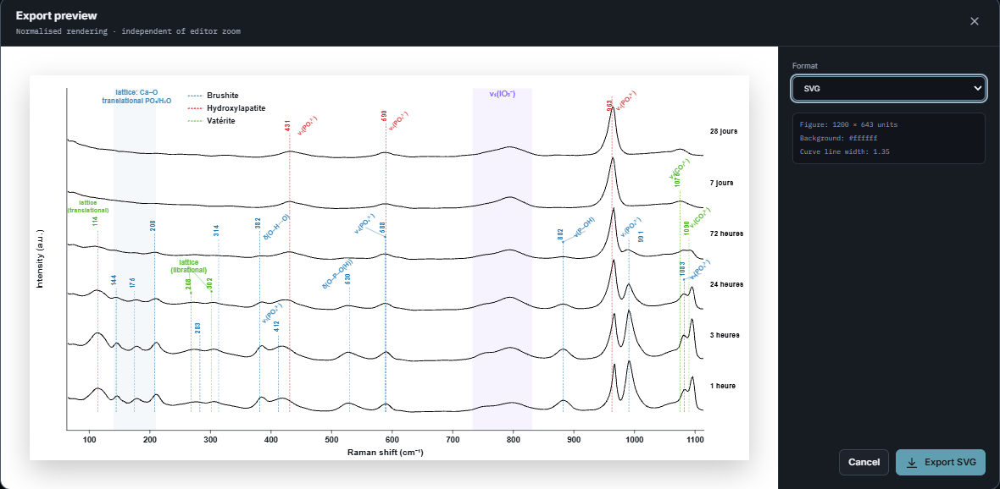</td>
  </tr>
</table>

Available outputs:

| Output | Use |
| --- | --- |
| PNG | Raster image with configurable scale and optional transparency |
| TIFF | High-resolution raster output with configurable DPI |
| SVG | Editable vector figure |
| PDF | Vector figure suitable for documents and publication workflows |
| CSV | Processed curves, detected peaks, tracking results or zone areas |
| JSON | Complete project session for backup or transfer |

### 6. Save and resume a project

The current project is autosaved in browser storage. This local autosave is tied to the current browser profile and can be removed if site data are cleared.

For a portable backup, export a **Session JSON** file. Restore it with the folder button beside **Active project**, or press <kbd>Ctrl/Cmd+O</kbd> and select the saved JSON file.

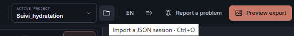

## Keyboard shortcuts

Shortcuts are ignored while typing in an input, text area or menu.

| Shortcut | Action |
| --- | --- |
| <kbd>Ctrl/Cmd+Z</kbd> | Undo |
| <kbd>Ctrl/Cmd+Shift+Z</kbd> or <kbd>Ctrl/Cmd+Y</kbd> | Redo |
| <kbd>Ctrl/Cmd+S</kbd> | Export the current session as JSON |
| <kbd>Ctrl/Cmd+O</kbd> | Import a JSON session |
| <kbd>Ctrl/Cmd+A</kbd> | Select all items in the active data tab |
| <kbd>Delete</kbd> or <kbd>Backspace</kbd> | Delete the current selection |
| <kbd>V</kbd> | Selection tool |
| <kbd>H</kbd> | Pan tool |
| <kbd>P</kbd> | Toggle peak-selection mode |
| <kbd>Z</kbd> | Toggle rectangular zoom |
| <kbd>N</kbd> | Toggle note-placement mode |
| <kbd>Esc</kbd> | Cancel the current interaction or clear the selection |

## Supported inputs

| Input | Formats |
| --- | --- |
| Acquisitions | <code>.xy</code>, <code>.txt</code>, <code>.csv</code>, <code>.dat</code>, <code>.xml</code>, <code>.xrdml</code> |
| Bruker OPUS spectra | OPUS XML and binary <code>.0</code>, <code>.1</code>, <code>.2</code>, <code>.3</code>, <code>.opus</code> files |
| Phase and reference data | <code>.dif</code>, <code>.cif</code>, <code>.txt</code>, <code>.csv</code>, <code>.dat</code> |
| Saved projects | <code>.json</code> sessions exported by the application |

Delimited text files should contain numeric X/Y columns. Header lines are tolerated when the numeric series can be identified. CIF files are converted into calculated XRD reference sticks using the selected wavelength.

## Workspace-specific tools

| Workspace | Additional tools |
| --- | --- |
| XRD | Phase sticks and labels, CIF calculation, 2θ/d/Q axes, wavelength selection, zero-shift estimation, instrumental corrections, peak fitting and series tracking |
| Raman | Local reference search, reference spectra, named integration zones, band-area calculation and optional zone ratios |
| IR | OPUS import, absorbance/transmittance handling, IR band references and named integration zones |

## Scope and limitations

- The application is intended for figure preparation and exploratory signal processing. It does not perform Rietveld refinement or quantitative phase analysis.
- Processing capacity depends on available browser memory; very large acquisition series may require preprocessing or subdivision.
- Browser autosave is not a substitute for an exported JSON backup.
- Imported scientific data remain local, but external browser resources such as the interface font may still be requested normally by the page.

## Run locally

Requirements: Node.js 18 or later and npm.

~~~bash
git clone https://github.com/MDES-CEA/Make_figure.git
cd Make_figure
npm install
npm run dev
~~~

Vite prints the local development URL after startup.

## Development and validation

~~~bash
npm test
npm run lint:css
npm run build
npm run preview
~~~

- <code>npm test</code> runs the unit, accessibility, export and interface-policy tests.
- <code>npm run lint:css</code> rejects top-level CSS declarations superseded later by the same selector.
- <code>npm run build</code> creates the production bundle in <code>dist/</code>.
- <code>npm run preview</code> serves the production build locally for final inspection.

The application is built with React, Vite and Tailwind CSS v4. It is a static client-side application and does not require a backend.

Interface changes are reviewed against the [interface principles](docs/interface-principles.md), including limits on decorative effects, redundant copy and speculative features.

## Repository structure

| Path | Purpose |
| --- | --- |
| <code>src/App.jsx</code> | Application state and interface rendering |
| <code>src/lib.js</code> | Import, processing, reference and scientific utility functions |
| <code>src/exportUtils.js</code> | SVG normalisation and export helpers |
| <code>src/i18n.js</code> | French and English interface strings |
| <code>src/index.css</code> | Interface layout and visual styles |
| <code>docs/screenshots/</code> | README interface captures |
| <code>docs/interface-principles.md</code> | Interface acceptance criteria |

## Feedback

Use the in-application **Report a problem** button or [open a GitHub issue](https://github.com/MDES-CEA/Make_figure/issues/new?template=bug_report.yml).

Include the following information when possible:

- active workspace: XRD, Raman or IR;
- browser and operating system;
- input format and a minimal non-confidential sample;
- steps required to reproduce the problem;
- expected and observed behaviour;
- screenshot of the interface or exported result.
