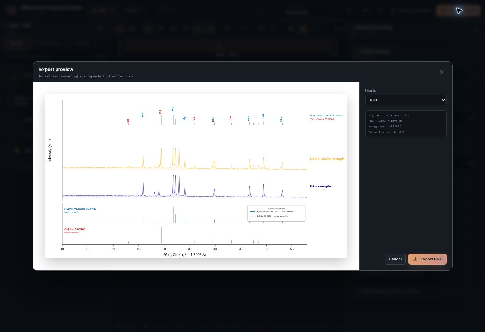

# Diffraction & Spectra Studio

A free, browser-based workspace for building publication-ready XRD, Raman and IR figures.

[Open the app](https://make-figure.vercel.app/) · [Report a problem](https://github.com/MDES-CEA/Make_figure/issues/new?template=bug_report.yml)


## What it does

Diffraction & Spectra Studio brings data import, signal processing, reference management, figure editing and export into one interface. It supports English and French and runs locally in the browser: imported data are not uploaded to a server.

- Work in dedicated **XRD**, **Raman** and **IR** spaces within the same project.
- Stack, overlay or compare several acquisitions.
- Smooth, normalise and correct baselines; detect, fit and track peaks.
- Add XRD phase references, Raman reference spectra and IR band lists.
- Edit curve labels, annotations, text size, weight, colours and line styles directly on the figure or from the option panels.
- Preview the normalised output before exporting to **PNG**, **TIFF**, **SVG** or **PDF**.
- Save and restore complete projects as JSON sessions.

The built-in sample data provide a quick way to explore the XRD workflow without preparing files first.

## Reference and processing tools

Reference display modes can be controlled independently: phase annotations, the reference panel and sticks drawn on the figure can each be shown or hidden. Processing controls remain available alongside the figure.


## Export preview

The preview uses the same normalised SVG as the exported file, independently of the editor zoom. The preview also reports the output dimensions, background and curve line width before export.



## Supported inputs

| Input | Formats |
| --- | --- |
| Acquisitions | `.xy`, `.txt`, `.csv`, `.dat`, `.xrdml`, Bruker OPUS XML and binary OPUS files (`.0`, `.1`, `.2`, `.3`, `.opus`) |
| Phase and reference data | `.dif`, `.cif`, `.txt`, `.csv`, `.dat` |
| Saved projects | `.json` sessions exported by the application |

Files can be selected from the import controls or dragged directly into the workspace. Recognised XRD, RRUFF Raman and OPUS files are routed to the appropriate analysis space.

## Run locally

Requirements: Node.js 18 or later and npm.

```bash
git clone https://github.com/MDES-CEA/Make_figure.git
cd Make_figure
npm install
npm run dev
```

Vite prints the local URL after startup.

## Development

```bash
npm test
npm run build
npm run preview
```

The application is built with React, Vite and Tailwind CSS v4. It is a static client-side application and does not require a backend.

Interface changes are reviewed against the [interface principles](docs/interface-principles.md), including limits on decorative effects, redundant copy and speculative features.

## Feedback

Use the in-app **Report a problem** button or [open a GitHub issue](https://github.com/MDES-CEA/Make_figure/issues/new?template=bug_report.yml). Include the active workspace, browser, steps to reproduce and a screenshot when possible.
